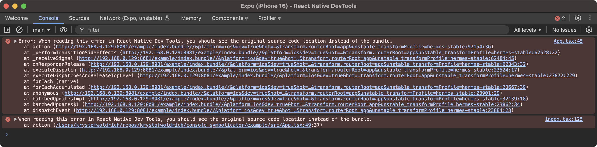

# react-native-console-symbolicator

Make all Errors logged via `console` API readable inside React Native DevTools.



### From

```
Error: When reading this error in React Native DevTools, you should see the original source code location instead of the bundle.
    at action (http://192.168.0.129:8081/example/index.bundle//&platform=ios&dev=true&hot=false&lazy=true&transform.engine=hermes&transform.bytecode=1&transform.routerRoot=app&unstable_transformProfile=hermes-stable:97154:36)
```

### To

```
Error: When reading this error in React Native DevTools, you should see the original source code location instead of the bundle.
    at action (/Users/krystofwoldrich/repos/krystofwoldrich/console-symbolicator/example/src/App.tsx:49:37)
```

## Installation

```sh
npm install react-native-console-symbolicator
```

## Usage


```js
import { installConsoleSymbolicator } from 'react-native-console-symbolicator';

// ...

installConsoleSymbolicator({
  excludeReactNativeCoreFrames: true,
});
```


## Contributing

See the [contributing guide](CONTRIBUTING.md) to learn how to contribute to the repository and the development workflow.

## License

MIT

---

Made with [create-react-native-library](https://github.com/callstack/react-native-builder-bob)
